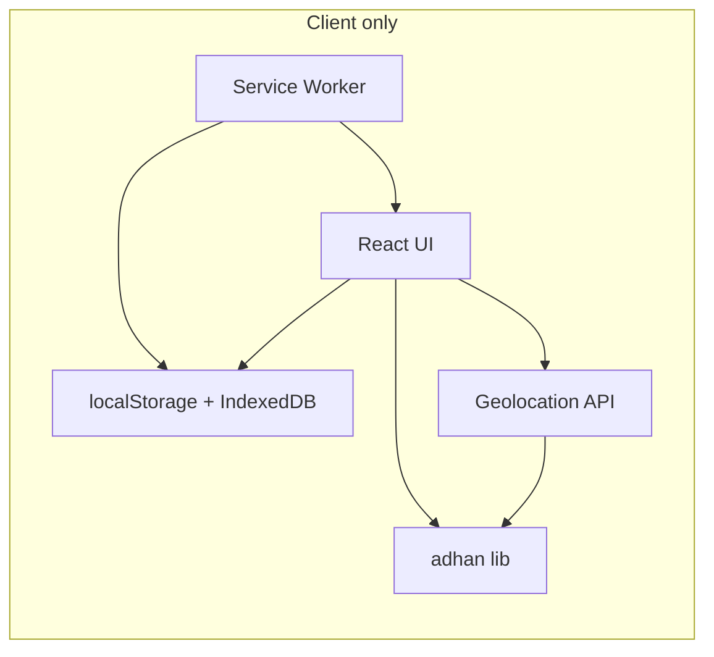

# Ramadan Tracker PWA – Build Plan

## Principles (non-negotiable)

- **Privacy-first**: No signup; all data in the browser (localStorage/IndexedDB).
- **Minimum friction**: One-tap location, no forms beyond goal setup.
- **Offline-first**: Core flows work with zero signal (mosque/basement).
- **Mobile-first PWA**: Installable, app-like, fast.
- **No ads**, minimalist UI, easy to share (Web Share API + shareable links).

---

## Tech Stack

| Layer        | Choice                                                                              | Rationale                                                                 |
| ------------ | ----------------------------------------------------------------------------------- | ------------------------------------------------------------------------- |
| Framework    | **Vite + React** (or Svelte if you prefer smaller bundle)                           | Fast dev, small build, easy PWA plugin.                                   |
| PWA          | **vite-plugin-pwa** (Workbox)                                                       | Offline caching, install prompt, configurable strategies.                 |
| Prayer times | **adhan** (npm)                                                                     | Client-side Fajr/Maghrib/Sunrise from lat/long; no API.                   |
| Storage      | **localStorage** for settings + **IndexedDB** (via idb or Dexie) for daily progress | Survives restarts; works offline; can scale to 30 days of checklist data. |
| Styling      | **Tailwind CSS** or minimal CSS                                                     | Fast, minimal UI, easy dark/light.                                        |
| Deployment   | Static host (Vercel, Netlify, GitHub Pages)                                         | No backend; optional edge for redirect to PWA.                            |

---

## Architecture (high level)

- **No server**. Optional: static JSON for Ramadan start/end dates by year (or compute from Hijri).
- **Geolocation**: User grants once; we cache coordinates and timezone for offline use. Fallback: manual city/list or last-known location.
- **Prayer times**: `adhan` + coordinates + date → Fajr, Sunrise, Maghrib (Suhoor end = Fajr, Iftar = Maghrib).

---

## Feature 1: Dynamic Goal Dashboard (“Daily 5”)

- **Items**: Prayers (5), Quran, Dhikr, Charity, Sunnah.
- **Model**: One record per day (keyed by date string). Each day has 5 booleans or small counters (e.g. prayers 0–5, Quran “done”, etc.).
- **UI**: Single screen with today’s date, 5 checkable cards. Tapping toggles state; state persisted to IndexedDB (and optionally synced to localStorage for instant read).
- **Offline**: All reads/writes local; no sync. Optional later: export/import JSON for backup.

---

## Feature 2: Quran Completion Calculator

- **Inputs**: Target = 1x or 2x completion; Ramadan length (e.g. 29/30 days); optional start day.
- **Constants**: 604 pages (Madani standard) or 30 juz; 1x = 604 pages, 2x = 1208.
- **Output**: Per-day target (e.g. 604/30 ≈ 20.13 pages/day for 1x) and optionally “per prayer” (e.g. 4 pages after each of 5 prayers).
- **UI**: Minimal form (target, days) → result: “Read X pages per day” and optionally “~Y pages per prayer.” Optional: link to Daily 5 so “Quran” can be marked done when user has hit the day’s target (manual or numeric input).

---

## Feature 3: Sunsets & Sunrises (Suhoor / Iftar)

- **Source**: Geolocation API → (lat, long). Pass into **adhan** with current date and a calculation method (e.g. MoonsightingCommittee or Muslim World League).
- **Display**: “Suhoor ends” = Fajr time; “Iftar” = Maghrib time. Optionally show Sunrise for reference.
- **Offline**: Cache last-known coordinates and last-computed times; recompute on date change using cached coords. If no coords (e.g. first visit offline), show “Enable location or set city” and a small list of cities (stored as lat/long) as fallback.
- **Privacy**: No coordinates sent to any server; all calculation in the client.

---

## Feature 4: Offline Support (PWA)

- **vite-plugin-pwa**: Precache app shell and critical assets (HTML, JS, CSS, app icons). Strategy: **Cache First** for shell, **Network First** (fallback cache) for any future API if you add one.
- **Data**: IndexedDB and localStorage are already offline-capable; ensure no feature requires network for core flows.
- **Prayer times**: Precompute and cache for current location for next 1–2 days so that if the user opens the app offline tomorrow, times still show.
- **Manifest**: Short name, theme color, display standalone, icons for install prompt.

---

## Feature 5: Virality (easy to share)

- **Web Share API**: “Share this app” (title + URL + short description). Optional: “Share my progress” that generates a short text (e.g. “I’ve completed 12/30 days of my Daily 5 – try the Ramadan Tracker”) and uses `navigator.share` if available.
- **Fallback**: Copy-to-clipboard for link or message.
- **No server**: Sharing is link to the PWA URL; no tracking or signup.

---

## Data Model (minimal)

- **Settings** (localStorage): `{ coordinates: { lat, lng }?, calculationMethod?, targetQuran: 1|2, ramadanDays: 29|30 }`.
- **Daily progress** (IndexedDB): `{ date: "YYYY-MM-DD", prayers: number, quran: boolean, dhikr: boolean, charity: boolean, sunnah: boolean }` (or similar).
- **Cache** (optional, in memory or IndexedDB): Prayer times for today/tomorrow for current coords to support offline.

---

## UI/UX (minimal, best-in-class)

- **Single primary screen**: Today’s Daily 5 + today’s Suhoor/Iftar + optional Quran daily target. Secondary screens: Settings (location, calculation method, Quran target), Quran calculator result, optional “Share.”
- **Mobile-first**: Large touch targets, bottom-safe-area padding, no hover-dependent actions.
- **Theme**: Simple light/dark (system or toggle); one clear type hierarchy and limited palette.
- **Copy**: Short, clear labels (e.g. “Suhoor ends”, “Iftar”, “Daily 5”).

---

## File / Module Structure (suggested)

- `src/
  - main.tsx` – entry, PWA registration.
- `src/App.tsx` – shell; routing (e.g. Home, Settings, Calculator) if multi-page, or single page with sections.
- `src/components/` – Daily5Checklist, PrayerTimesCard, QuranCalculator, ShareButton.
- `src/lib/` – prayer times (adhan wrapper), storage (settings + progress), geo (get/cache coordinates).
- `src/hooks/` – usePrayerTimes, useDailyProgress, useGeolocation.
- `src/data/` – constants (Quran 604 pages, 30 juz), optional city list for fallback.
- `public/` – manifest, icons, offline fallback page if needed.

---

## Implementation Order

1. **Scaffold**: Vite + React + TypeScript, Tailwind, vite-plugin-pwa, adhan. Basic manifest and one icon. Run and confirm installable.
2. **Prayer times**: Geolocation + adhan; show Suhoor (Fajr) and Iftar (Maghrib) on a simple card; cache coords and handle “no location” with fallback message or city list.
3. **Storage**: Settings in localStorage; IndexedDB for daily progress; helper hooks (useSettings, useDailyProgress).
4. **Daily 5**: UI for today’s checklist; read/write from IndexedDB; date-based key so it’s always “today.”
5. **Quran calculator**: Form (1x/2x, days) → daily pages/juz; display result and optionally tie into Daily 5 “Quran” goal.
6. **Offline hardening**: Precache shell; cache prayer times for today/tomorrow; test with DevTools offline.
7. **Share**: Web Share API + copy fallback; optional “Share my progress” text.
8. **Polish**: Theme, accessibility, install prompt, and one final pass on “minimum friction” (e.g. first-run location prompt, default 30 days for Ramadan).

---

## Optional Later (out of initial scope)

- Ramadan start/end by Hijri year (small static data or client-side Hijri lib).
- Gentle notifications (e.g. “Iftar in 10 min”) via PWA Notifications (optional, user permission).
- Export/import of progress as JSON file for backup.

---

## Summary

You get a single codebase: **Vite + React PWA**, **adhan** for Suhoor/Iftar from geolocation, **IndexedDB + localStorage** for goals and settings, **Workbox** for offline, and **Web Share** for virality. No backend, no signup, no ads; maximum clarity and minimum friction.